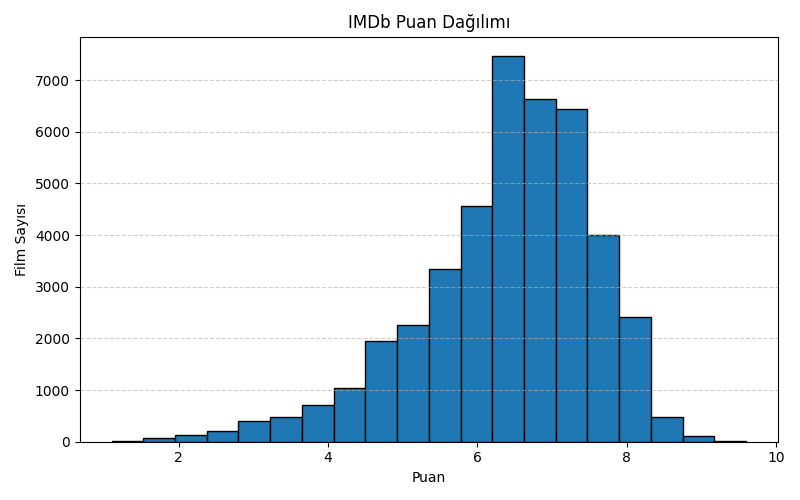
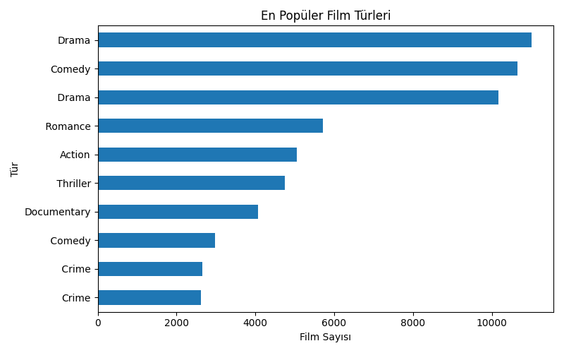
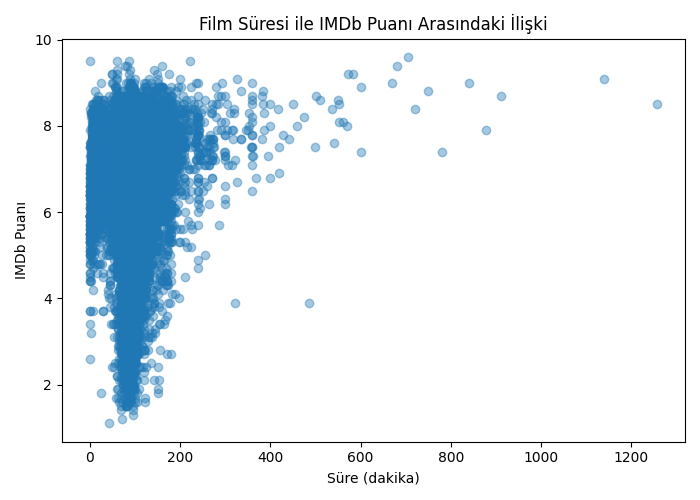
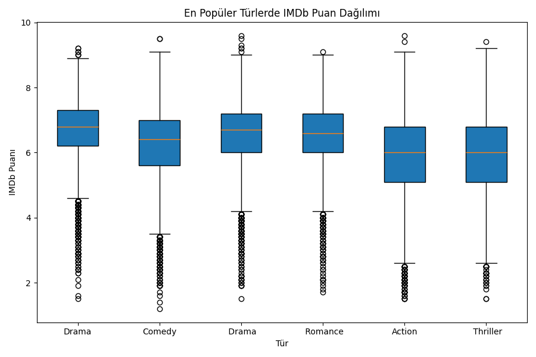

# 🎬 IMDb Film Veri Seti Analizi

Bu proje, IMDb film verilerini **temizleme, analiz etme, görselleştirme ve raporlama** adımlarını içeren bir Python çalışmasıdır.  
Kullanılan veri seti Kaggle’daki *IMDb Movies Analysis* dosyasıdır.

# 📌 Projede Yapılanlar

### ✔ Veri Yükleme  
CSV dosyası Pandas ile okunur ve ilk bakış verileri incelenir.

### ✔ Veri Temizleme  
Kodda yapılan işlemler:
- Sütun adlarını düzenleme  
- Rating, süre, yıl, oy sayısı gibi değerleri sayısala çevirme  
- Tür listesini ayıklama  
- Yönetmen ve film adlarını temizleme  
- Yinelenen filmleri kaldırma  

### ✔ Keşifsel Veri Analizi (EDA)
- Sayısal sütun özetleri  
- En yüksek puanlı 20 film  
- En çok oylanan 20 film  
- En yaygın türler  
- Yönetmen başına film sayısı  
- Süre–puan korelasyonu  
- Yıllara göre film üretim trendi  

### ✔ Görselleştirme (Matplotlib)
Kod çalıştığında tüm grafikler **outputs/** klasörüne kaydedilir.

Aşağıda grafik ön izlemeleri:

#### ⭐ IMDb Puan Dağılımı  

#### 🎭 En Popüler Türler  

#### ⏳ Süre – Puan İlişkisi  

#### 📦 En Popüler Türlerde Puan Boxplot  

# 📝 Raporlama  
Kod sonunda **Report/imdb_raporu.txt** dosyası oluşturulur. Raporda şunlar bulunur:

- Genel istatistikler  
- En popüler türler  
- En yüksek puanlı 10 film  
- En çok film çeken yönetmenler  
- Son 10 yılın film üretim sayıları

- ## Çalıştırma
  
- #### 1. Repo’yu klonlayın:
- '''bash
- 
git clone https://github.com/sila-saldiz/Film‑Veri‑Seti‑Analizi.git
cd Film‑Veri‑Seti‑Analizi
'''

#### 2. Gerekli kütüphaneleri yükleyin:
pip install pandas numpy matplotlib

#### 3. Veri dosyasını proje klasörüne koyun ya da dosya yolunu güncelleyin:
#### Örneğin: imdb_movies.csv (veya README’de belirtildiği dosya)

#### 4. Ana script’i çalıştırın:
python your_script_name.py   # (örneğin: imdb_analysis.py)

#### 5. Çıktılar:
#### – Grafikler → outputs/ klasörü
#### – Rapor → Report/imdb_raporu.txt

